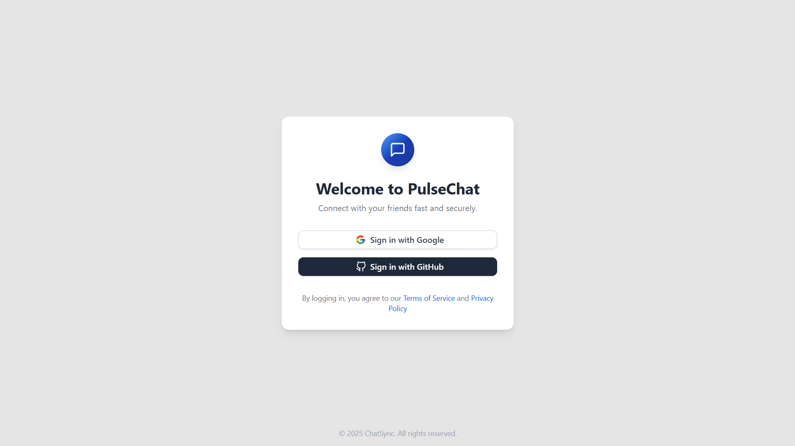
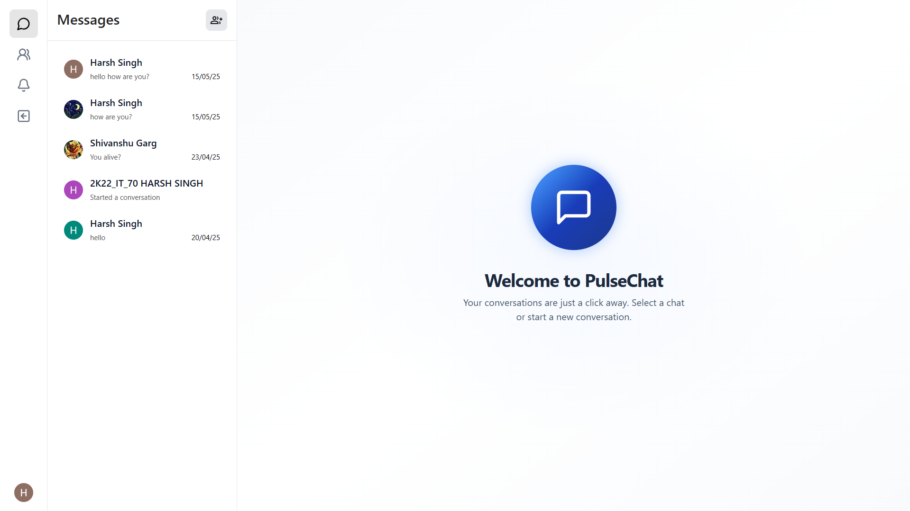
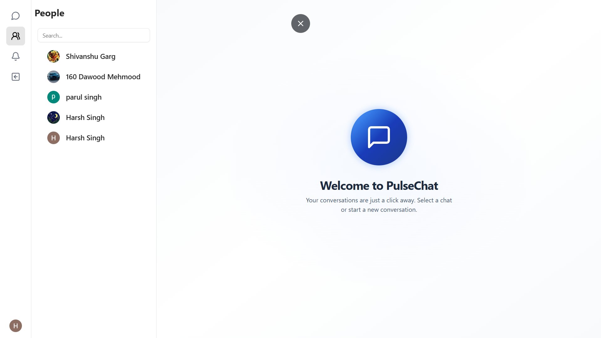
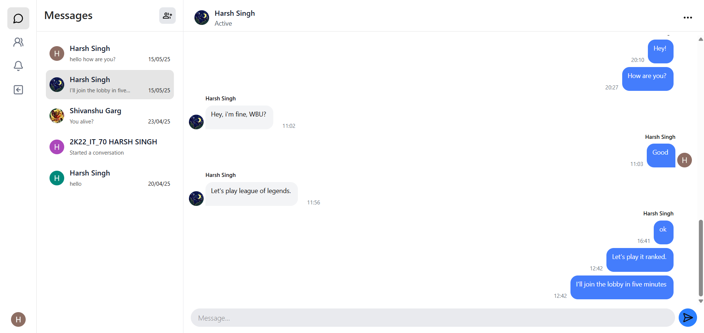

# PulseChat Frontend

Next.js-based frontend for PulseChat real-time messaging application with Socket.IO integration.

## Overview

This is the frontend client for PulseChat, built with Next.js and Socket.IO for real-time communication. It provides a responsive chat interface with instant messaging capabilities, user authentication, and real-time presence tracking.

## Tech Stack


## Features

- **Real-time messaging** with Socket.IO
- **Message history** display
- **Responsive design** for mobile and desktop
- **Clean and intuitive UI**

## Demo Screenshots

<div align="center">
  
  
  
  
</div>

## Prerequisites

- Node.js (v16 or higher)
- npm or yarn
- PulseChat Backend server running

## Installation

1. **Clone the repository**
```bash
git clone https://github.com/HarshS490/chat-app2.0.git
cd chat-app2.0
```

2. **Install dependencies**
```bash
npm install
# or
yarn install
# or
pnpm install
# or
bun install
```

3. **Environment Setup**
```bash
cp .env.example .env.local
```

4. **Configure environment variables**
```env
NEXT_PUBLIC_SERVER_URL=http://localhost:5000
NEXT_PUBLIC_SOCKET_URL=http://localhost:5000
```

5. **Start the development server**
```bash
npm run dev
# or
yarn dev
# or
pnpm dev
# or
bun dev
```

The application will open at `http://localhost:3000`

## Project Structure

```
app/
├── components/
│   ├── chat/
│   ├── auth/
│   └── ui/
├── lib/
│   ├── socket.ts
│   └── utils.ts
├── styles/
│   └── globals.css
├── page.tsx
├── layout.tsx
└── globals.css
public/
├── images/
└── icons/
```

## Key Components

### Socket Service (`lib/socket.ts`)
Manages Socket.IO connection and real-time events:
- Message sending/receiving
- Connection status

### Chat Components
- **ChatRoom**: Main chat interface container
- **MessageList**: Displays chat messages
- **MessageInput**: Input field for typing and sending messages

## Available Scripts

```bash
# Start development server
npm run dev

# Build for production
npm run build

# Start production server
npm start

# Run linting
npm run lint
```

## Environment Variables

| Variable | Description | Default |
|----------|-------------|---------|
| `NEXT_PUBLIC_SERVER_URL` | Backend API URL | `http://localhost:5000` |
| `NEXT_PUBLIC_SOCKET_URL` | Socket.IO server URL | `http://localhost:5000` |

## Building for Production

```bash
npm run build
```

This creates an optimized production build in the `.next` folder.

## Deployment

The app can be deployed to:
- **Vercel**: Connect your GitHub repository (recommended for Next.js)
- **Netlify**: Static export with `next export`
- **AWS Amplify**: Connect your GitHub repository
- **Docker**: Use the included Dockerfile

## Socket.IO Events

### Emitted Events
- `send-message`: Send a new message

### Listened Events
- `receive-message`: New message received

---

## Future Improvements

The following features are planned for future releases:

### Phase 1 - Enhanced Chat Experience
- **Typing Indicators**: Show when users are typing in real-time
- **Online/Offline Status**: Display user presence indicators
- **Message Status**: Read receipts and delivery confirmations
- **Emoji Reactions**: React to messages with emojis

### Phase 2 - Advanced Features
- **File Sharing**: Upload and share images, documents, and media
- **Voice Messages**: Record and send voice notes
- **Message Search**: Search through chat history
- **Message Threading**: Reply to specific messages

### Phase 3 - Rich Communication
- **Video Calls**: One-on-one video calling functionality
- **Audio Calls**: Voice calling between users
- **Screen Sharing**: Share screen during calls
- **Group Video Calls**: Multi-user video conferencing

### Phase 4 - Enhanced User Experience
- **Dark/Light Theme**: Toggle between themes
- **Push Notifications**: Real-time notifications
- **Message Encryption**: End-to-end encryption for privacy

### Phase 5 - Advanced Features
- **Language Translation**: Real-time message translation
- **Voice-to-Text**: Convert voice messages to text
- **Smart Suggestions**: AI-powered message suggestions
- **Analytics Dashboard**: Chat statistics and insights

## Contributing

1. Fork the repository
2. Create your feature branch (`git checkout -b feature/amazing-feature`)
3. Commit your changes (`git commit -m 'Add amazing feature'`)
4. Push to the branch (`git push origin feature/amazing-feature`)
5. Open a Pull Request

## Related Repositories

- **Backend**: [PulseChat Backend](https://github.com/HarshS490/pulsechat-backend)

## Support

For frontend-specific issues, please create an issue in this repository.
